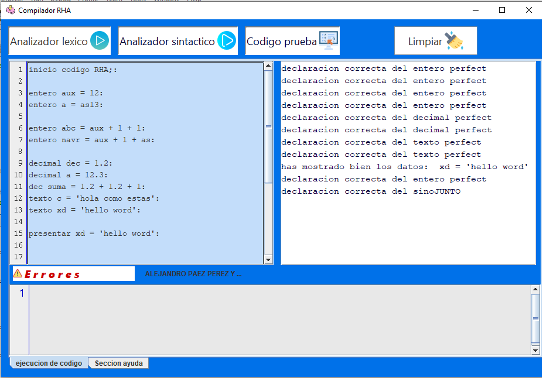
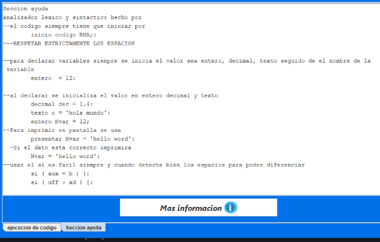

# compiladorPaez👩‍💻
un analizador lexico y sintactico sin jflex
se guarda en un arreglo despues de un ":" para luego ser analizados por el metodo matches

```java   
//para guardar los datos que se ingresa en el area de texto        
        txt_errores.setText("");
        txt_salida.setText("");
        
        String Entrada = txt_entrada.getText();//.replaceAll("", "\n");// para sustituir el ; por un enter
        Entrada = Entrada.trim();//ignora los espacios
        Arreglo = Entrada.split(":");//que despues del : se guarda en el siguiente arreglo


```


```java
// DECLARACION ENTERO y Operaciones
          if(Arreglo[i].contains("entero ")){
                  if(Arreglo[i].matches("([\\s]*entero [a-zA-Z]*[0-9]* = ([a-zA-Z]*[0-9]*))|("+operacionE+")")){
                    if(Arreglo[i].matches("([\\s]*entero ("+palabra_reservada+") = ([a-zA-Z]*[0-9]*))|("+operacionE+")")){
                        System.out.println("error por que es una palabra reservada \n");
                        txt_errores.append("es una palabra reservada:  "+Arreglo[i].replaceAll("\n","")+"\n");

                    }else{
                     txt_salida.append("declaracion correcta del entero perfect \n");
                    dato_entero +=(Arreglo[i].replaceAll("\\s*"+"entero ","").replaceAll(" = ([a-zA-Z]*[0-9]*)|("+operacionE+")","")+"|");
                    enterobien = true;
                    }  
                   
                    }else {
                        txt_errores.append("no has declarado bien el valor ent:  "+Arreglo[i].replaceAll("\n","")+"\n");
                         enterobien = false;
                    }
            }
   ```

## pantalla principal tiene una pestaña de seccion de ayuda en la parte de abajo


## seccion de ayuda con la sintaxis del lenguaje


